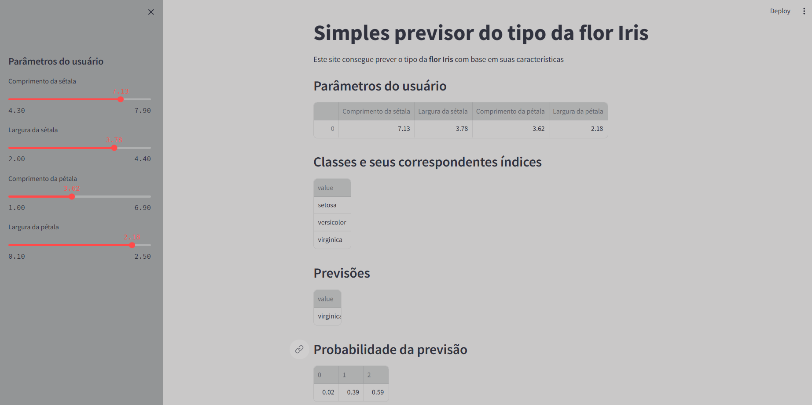

# Introdução

Bem-vindo ao Preditor de Tipo de Flor Iris, uma aplicação web que utiliza técnicas avançadas de aprendizado de máquina para prever o tipo da flor Iris com base em características específicas. Desenvolvido com o framework Streamlit e a biblioteca scikit-learn, este aplicativo oferece uma interface amigável para usuários explorarem e entenderem melhor o processo de classificação.



## Funcionalidades Principais

### Entrada de Parâmetros do Usuário

- O aplicativo permite que os usuários ajustem os parâmetros da flor Iris, incluindo comprimento e largura da sépala e pétala, através de controles deslizantes na barra lateral. Isso proporciona uma experiência interativa e intuitiva.
```python
def user_input():
    sepal_length = st.sidebar.slider('Comprimento da sétala', 4.3, 7.9, 5.4)
    sepal_width = st.sidebar.slider('Largura da sétala', 2.0, 4.4, 3.4)
    petal_length = st.sidebar.slider('Comprimento da pétala', 1.0, 6.9, 1.3)
    petal_width = st.sidebar.slider('Largura da pétala', 0.1, 2.5, 0.2)
    dados = {'Comprimento da sétala': sepal_length,
             'Largura da sétala': sepal_width,
             'Comprimento da pétala': petal_length,
             'Largura da pétala': petal_width}
    features = pd.DataFrame(dados, index=[0])
    return features
```

### Modelo de Machine Learning

- Utilizando um sofisticado classificador RandomForest treinado com o conjunto de dados padrão Iris, o aplicativo realiza previsões precisas com base nos parâmetros fornecidos pelo usuário.

### Apresentação de Resultados

- Os resultados são apresentados de maneira clara e compreensível. O aplicativo exibe não apenas as previsões do modelo, mas também fornece informações sobre as probabilidades associadas a cada previsão. Além disso, são mostrados os nomes das classes e seus índices correspondentes, proporcionando um contexto mais rico.

## Instruções de Uso

### Instalação de Dependências

Antes de executar o aplicativo, certifique-se de instalar as dependências necessárias. Execute o seguinte comando:

```bash
pip install streamlit
```
```bash
pip install pandas
```
```bash
pip install scikit-learn
```

### Execução do Aplicativo
Inicie o aplicativo utilizando o seguinte comando no terminal:

```bash
streamlit run nome_do_arquivo.py
```
- Substitua nome_do_arquivo.py pelo nome do arquivo onde você salvou o código.

## Desenvolvimento Adicional
Este aplicativo é um ponto de partida sólido para explorações mais avançadas. Para desenvolvimento adicional, considere aprimorar o design com elementos visuais mais complexos, incorporar análises estatísticas adicionais ou até mesmo explorar diferentes algoritmos de aprendizado de máquina.

Sinta-se à vontade para explorar e personalizar o código de acordo com suas necessidades específicas. Boa jornada no desenvolvimento e aprimoramento deste projeto!
